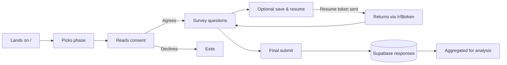

# P2 — Research Lane (`/about/research`)

## Goal

A research-narrative surface for the PhD candidate's supervisors, examiners, and academic collaborators. Explains the study design end-to-end: research question, conceptual framework, the two-phase instrument, sampling, ethics, current progress, and live (anonymised) response counts. English-only. Optimised for being projected on a screen during a progress presentation.

Done means a supervisor visiting `/about/research` can answer: *"What is she studying, why those phases, how many responses so far, and how does the methodology hold together?"* without opening any other tab.

## Why now

- This is the lane the candidate will use most during her own progress committee meetings — high direct value.
- Forces a clean `createServerFn` for aggregated response counts, exercising the server-boundary pattern from `AGENTS.md` § "Server Boundaries" before the heavier engineering lane lands.
- Builds on top of P0 infra (Markdown loader for the narrative sections, `recharts` for live counts) — no new dependencies.

## Sources

- `src/surveys/phase-1.ts`, `src/surveys/phase-3.ts`, `src/surveys/consent.ts` — the canonical study instrument.
- `src/surveys/index.ts` — the `SURVEY_LIST` shape (slug, title, subtitle, estimated minutes).
- `src/integrations/supabase/client.ts` and existing admin analytics in `src/routes/admin.tsx` — for the response-count query pattern. Reuse the same aggregation strategy; do not invent a new one.
- `docs/RESEARCHER_OPS.md` — operational details that should NOT appear on this page (it's an internal runbook).
- `audits/13-codex-parity-supplement.md` and `audits/00-overview.md` — for context about what has changed since the original audit. Useful for the "Methodology evolution" section if included.
- The candidate's own thesis chapters / proposal — *external to repo*. Some of the narrative text on this page (research question, framework, sampling justification) must be authored or pasted in by her, not invented by Claude. The lane plan includes a placeholder section labelled "Candidate-authored" so the seam is explicit.

## Content plan

Single scrollable page, 5 sections, with a sticky right-rail in-page nav (re-using the `AboutLayout` content column on desktop).

### Section 1 — Snapshot (top of page)

A two-column block:

- **Left:** a `<StudyAtAGlanceCard>` — title of the study, candidate name, supervisors (placeholder if unknown), institution, period (e.g. 2025–2027), status (e.g. "Phase 1 data collection in progress").
- **Right:** a `<LiveResponseCounts>` card driven by a `createServerFn` aggregation query. Shows total responses, breakdown by phase, breakdown by language, "last response received N hours ago" — all anonymised, all aggregate.

### Section 2 — Research question and framework

Markdown-rendered prose from `src/about/content/research/01-framework.md` (a new file under version control authored by the candidate). The lane plan creates the file with placeholder content + a `<!-- CANDIDATE: please replace -->` HTML comment so the seam is obvious in a review.

### Section 3 — Two-phase instrument

A `<PhaseTimeline>` visual (Mermaid `timeline` or hand-drawn React + Tailwind):

- Phase 1 — Industry Profile (~12 min, 8 sections A–H per `phase-1.ts`)
- Phase 3 — Stakeholder (description from `phase-3.ts`)

For each phase: section list (A–H labels straight from the survey source), question count (computed at build time from `phase1.questions.length`), estimated time, current response total (live).

Below the timeline, a `<SampleFlowDiagram>` showing the participant pathway:



(The diagram source above is illustrative; the implementing session refines wording with the candidate.)

### Section 4 — Sampling, ethics, consent

Markdown from `src/about/content/research/02-sampling-ethics.md` — candidate-authored. The plan creates the file with a structure outline (sampling frame, recruitment channels, IRB / ethics approval reference, consent process pointing to `src/surveys/consent.ts`) and `<!-- CANDIDATE -->` markers.

### Section 5 — Progress and milestones

A timeline visual showing past + upcoming milestones — driven by a small JSON file `src/about/content/research/milestones.json` so the candidate can update it without touching React.

```json
[
  { "date": "2025-11-01", "label": "Proposal defended", "status": "done" },
  { "date": "2026-03-15", "label": "Phase 1 instrument finalised", "status": "done" },
  { "date": "2026-05-26", "label": "Phase 1 data collection mid-point", "status": "in-progress" },
  { "date": "2026-08-01", "label": "Phase 3 launch", "status": "upcoming" }
]
```

Rendered as a vertical timeline with status pills (`done` = filled, `in-progress` = pulsing, `upcoming` = outlined).

## Sessions

### Session 2.1 — `createServerFn` for aggregated response counts (S, ~1.5h)

```text
Goal: An RPC `getResearchAggregates()` returns anonymised counts safely callable from `/about/research`.

Pre-work (read-only):
- AGENTS.md § Server Boundaries (the `*.impl.server.ts` rule)
- src/routes/admin.tsx — for the existing admin analytics query patterns. Reuse the same Supabase client and the same RLS posture.
- supabase/migrations/ — confirm there is no PII in the columns being aggregated. If `responses` includes IP address / user-agent strings, exclude them from the projection.

Implementation:

1. Create `src/about/server/research-aggregates.impl.server.ts`:
   - Exports `getResearchAggregates(): Promise<{ totals: { all: number; phase1: number; phase3: number }, byLang: Record<'en'|'si'|'ta', number>, lastResponseAt: string | null }>`.
   - Uses the service-role Supabase client (same as admin analytics) but selects ONLY aggregate counts via Postgres `count()` and `max(created_at)`. No row data leaves the server.
2. Create the RPC wrapper `src/about/server/research-aggregates.ts`:
   - `export const getResearchAggregatesFn = createServerFn({ method: 'GET' }).handler(async () => (await import('./research-aggregates.impl.server')).getResearchAggregates())`.
   - This wrapper is the only thing the client imports.
3. Add a unit test for the impl module: mock the Supabase client and assert the shape of the returned object + that no `select('*')` calls are made.
4. Add a cache header to the response (e.g. `Cache-Control: public, max-age=60, stale-while-revalidate=600`) — counts update every minute is plenty for a presentation context, and protects Supabase from being hit hard if the page is opened on multiple screens.

Verification:
- bun run typecheck && bun run lint && bun run test
- Manually: visit `/about/research` (after session 2.4) and confirm Network tab shows a single XHR/RPC to the function, returns aggregate JSON, no PII.
```

### Session 2.2 — Phase timeline + sample-flow diagram (S, ~1h)

```text
Goal: Two visuals — a `<PhaseTimeline>` listing the two phases with section letters, counts, and time estimates; a `<SampleFlowDiagram>` rendering the participant pathway via Mermaid.

Pre-work (read-only):
- src/surveys/phase-1.ts, src/surveys/phase-3.ts
- src/about/components/MermaidBlock.tsx (from P0 session 0.3)

Implementation:

1. `src/about/components/research/PhaseTimeline.tsx`:
   - Takes `phases: SurveyMeta[]` where `SurveyMeta` is computed at build time from `SURVEY_LIST` (slug, title.en, estimatedMinutes, section count, question count).
   - Renders a horizontal flex of two `<PhaseCard>`s with a connecting arrow. Mobile: vertical stack.
   - Each card lists section letters (A–H) parsed at build time from the survey source via a small helper that extracts unique `section.id` letters from the questions array.
2. `src/about/components/research/SampleFlowDiagram.tsx`:
   - Static React component that imports the Mermaid source from `src/about/diagrams/sample-flow.mmd?raw` and passes it to `<MermaidBlock>`.
3. Create `src/about/diagrams/sample-flow.mmd` with the flowchart from the content plan above; iterate with the candidate.

Verification:
- bun run typecheck && bun run lint && bun run test
- Manually: visit `/about/research`, confirm both visuals render correctly on desktop and mobile.
```

### Session 2.3 — Live counts card + milestones timeline (S, ~1h)

```text
Goal: Render the live aggregate counts via the server fn from session 2.1, and the milestones timeline from `milestones.json`.

Pre-work (read-only):
- src/about/server/research-aggregates.ts (session 2.1)
- src/about/content/research/milestones.json (created in this session)

Implementation:

1. `src/about/components/research/LiveResponseCounts.tsx`:
   - Uses TanStack Query to fetch from `getResearchAggregatesFn`.
   - Renders four mini-stat tiles: total, by phase, by language, last received.
   - Loading state: skeleton tiles. Error state: muted "live counts unavailable" — never blocks the page.
2. `src/about/components/research/MilestoneTimeline.tsx`:
   - Reads `src/about/content/research/milestones.json` (static import).
   - Renders a vertical timeline with status pills (`done` / `in-progress` / `upcoming`).
   - Format dates with `Intl.DateTimeFormat` using en-LK locale.
3. Create `milestones.json` with the example entries from the content plan as starting content; the candidate edits over time.

Verification:
- bun run typecheck && bun run lint && bun run test
- Trigger the loading + error states locally (block the network in DevTools) and confirm graceful degradation.
```

### Session 2.4 — Compose the page (S, ~1h)

```text
Goal: Replace the placeholder in `src/routes/about.research.tsx` with the full 5-section page.

Pre-work (read-only):
- All session 2.1–2.3 components.
- src/about/content/research/01-framework.md and 02-sampling-ethics.md (create as placeholder, see Implementation step 1).

Implementation:

1. Create `src/about/content/research/01-framework.md` and `02-sampling-ethics.md` with section headings + `<!-- CANDIDATE: please replace this paragraph -->` placeholders so the lane ships visibly-incomplete content for the candidate to fill in via her normal Markdown editing flow.
2. Compose the route component: hero / Snapshot row → Framework markdown → Phase timeline → Sample flow → Sampling/ethics markdown → Milestones timeline.
3. Add a right-rail in-page nav (sticky `<aside>` on desktop with anchor links to each section). Hidden on mobile to preserve real-estate.
4. Set page `<head>` metadata to English (no language toggle on this page; the LanguageToggle component is omitted from the AboutLayout when the active lane is `research` or `engineering`).
5. Add `useAboutSection("research", "Research narrative")` for the breadcrumb.

Verification:
- bun run typecheck && bun run lint && bun run test
- bun run build && bun run size # the `recharts` chunk is already in the survey bundle? Check. If the research page is the only consumer of a new Recharts module, it should still lazy-chunk via the `/about` boundary.
- Manually: visit `/about/research`, scroll through, click each right-rail anchor, confirm smooth scroll + active-section highlight (if implemented).
- Verify the live counts card hydrates with real data when Supabase is reachable.
```

## Done criteria

- [ ] `getResearchAggregatesFn` returns aggregate counts only; unit test asserts no row-level data leaks.
- [ ] Phase timeline + sample flow render correctly on desktop and mobile.
- [ ] Live counts card hydrates with data; loading and error states are graceful.
- [ ] Milestones JSON is rendered as a timeline; candidate can edit the JSON without React knowledge.
- [ ] Two Markdown content files exist as placeholders with explicit `<!-- CANDIDATE -->` markers.
- [ ] `/about/research` page composes all five sections + right-rail nav (desktop).
- [ ] Language toggle is hidden on this lane; page is English-only.
- [ ] All gates green: `typecheck && lint && test && build`. Bundle size for `/`, `/s/phase-1`, `/r/$token` unchanged.

## Risks

- **Live counts could become a sample-size disclosure** at very small N (e.g. "Phase 3 responses: 2"). For a research presentation that may be undesirable. Mitigation: round all counts under 10 down to "<10" in the server fn before returning. Document the threshold in code.
- **Anonymity by language breakdown.** Showing 1 Tamil response + 0 Sinhala is a re-identification vector when combined with timestamps. Same `<10` mitigation applies.
- **Mermaid timeline syntax** is finicky across versions. If `mermaid` major-bumps, the diagram could break silently. Mitigation: the smoke render test in P0 session 0.3 catches a Mermaid-side failure; add a research-specific test that asserts the sample-flow diagram source is non-empty and contains the expected node names.
- **Markdown placeholders ship to production.** A reviewer landing on this page before the candidate fills it in sees `<!-- CANDIDATE -->` comments only in the source — they render as nothing in the browser. That's fine; the surrounding placeholder prose makes the gap visible. Alternative: replace with a visible "Coming soon" alert until the candidate has authored content. Decide before merging.
- **`recharts` is already a dependency** — verify in `package.json` before assuming. If it ends up in the survey chunk because the chart tooling is statically imported elsewhere, ensure the research lane doesn't make it worse.
